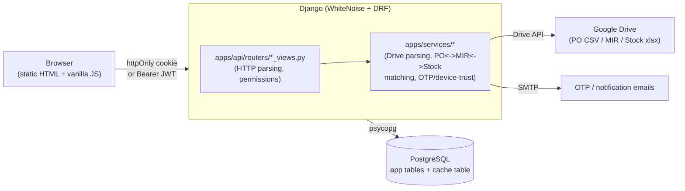
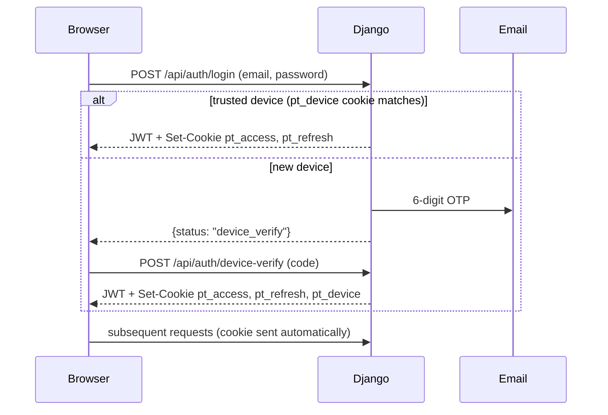

# Architecture

A lightweight map of how the pieces fit together. For command reference and non-obvious
gotchas, see [CLAUDE.md](CLAUDE.md); for setup, see [README.md](README.md).

This app's auth/security scaffolding is a deliberate port of the TDS Automation App's
architecture (`C:\Users\Admin\OneDrive\Desktop\TDS Automation App\tds_app`) - same conventions,
different domain. See CLAUDE.md's "Auth & security architecture" section for what was ported vs.
deliberately simplified for this app.

## Request flow

## Layering rules

- **`apps/core`**: models + migrations only. No views, no business logic (parsers, matching
  engines, Drive access, sync helpers all live in `apps/services` instead - see "Auth & security
  architecture" in CLAUDE.md for why this split exists and what a pre-split version of this repo
  looked like).
- **`apps/api/routers/*_views.py`**: HTTP layer - parse the request, check permissions, call a
  service function or query the ORM directly for simple read endpoints, shape the response. Do
  not embed Drive-parsing/matching logic here.
- **`apps/services/*`**: Drive access (`google_client.py`), per-plant parsers (`parsers/`),
  PO<->MIR<->Stock matching engines (`matching.py`/`matching_achhad.py`/`matching_vapi.py`),
  change-detection (`sync_utils.py`), and the auth-adjacent services (`device_service.py`,
  `otp_service.py`, `email_service.py`).
- **`frontend/`**: static, no build step. `css/style.css` holds cross-page rules; each page layers
  page-specific CSS in its own `<style>` block. `js/auth.js` has no imports and must load first on
  `index.html` (the protected dashboard) - it gates the page behind `requireAuth()` before
  `main.js` runs.

## Data model shape

Per-plant models, not a shared schema (see CLAUDE.md for the full rationale) - `HRSPurchaseOrder`/
`RTPAchhadPurchaseOrder`/`RTPVapiPurchaseOrder` and their `*POLineItem`/`*MIREntry`/`*StockLot`/
`*StockSnapshot`/`*POMirMatch`/`*MirStockMatch` siblings are fully independent per plant.
`SyncRun` is the one shared table (a generic sync-job log, not a plant-shaped data table).

Auth tables are plant-agnostic and shared across the whole app: `PTUser` (`pt_users`), `OTPCode`
(`pt_otp_codes`), `TrustedDevice` (`pt_trusted_devices`).

## Auth flow

`pt_access` (12h) and `pt_refresh` (30 days, path-scoped to `/api/auth/`) are httpOnly. A
non-browser API client can skip cookies entirely and send `Authorization: Bearer <access_token>`
instead - `PTCookieJWTAuthentication` tries the cookie first, falls back to the header. Google
OAuth (`GET /api/auth/google/login/`) goes through the identical device-trust gate after Google
authenticates the user - see `apps/api/routers/google_oauth_views.py`.

## Known architectural constraints

- **No custom user-management UI yet** - creating/promoting/deactivating a `PTUser` is either
  `manage.py create_pt_user` (CLI) or Django Admin at `/admin/` (can view/edit role/`is_active`,
  cannot set a password - the form excludes `password_hash`). A dedicated admin-facing "Users"
  page is future work, not built in this pass.
- **No role differentiation on any current API endpoint** - every existing endpoint (PO list,
  materials, stock trend, sync status) is a read-only GET gated at plain `IsAuthenticated`; `admin`/
  `editor`/`viewer` are modeled and enforced (`apps/api/permissions.py`'s `IsAdmin`/`IsEditor`) but
  nothing currently uses the stricter checks - see CLAUDE.md's "Known gaps" for what would.
- **`cache_page` infrastructure exists, nothing uses it yet** - `DatabaseCache` is wired up and
  test-safe, but every current endpoint is real business data behind auth, not the kind of public
  reference data `cache_page` is safe to sit in front of (see the `cache_page`-must-be-`AllowAny`
  rule in CLAUDE.md).
