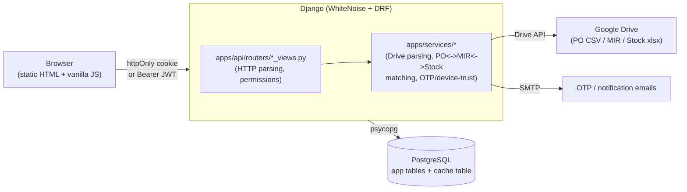
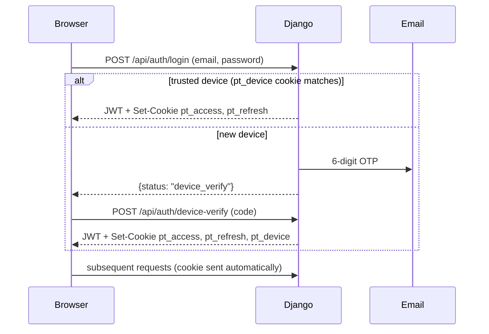

# Architecture

A lightweight map of how the pieces fit together. For command reference and non-obvious
gotchas, see [CLAUDE.md](CLAUDE.md); for setup, see [README.md](README.md).

This app's auth/security scaffolding is a deliberate port of the TDS Automation App's
architecture (`C:\Users\Admin\OneDrive\Desktop\TDS Automation App\tds_app`) - same conventions,
different domain. See CLAUDE.md's "Auth & security architecture" section for what was ported vs.
deliberately simplified for this app.

## Request flow

## Layering rules

- **`apps/core`**: models + migrations only. No views, no business logic (parsers, matching
  engines, Drive access, sync helpers all live in `apps/services` instead - see "Auth & security
  architecture" in CLAUDE.md for why this split exists and what a pre-split version of this repo
  looked like).
- **`apps/api/routers/*_views.py`**: HTTP layer - parse the request, check permissions, call a
  service function or query the ORM directly for simple read endpoints, shape the response. Do
  not embed Drive-parsing/matching logic here.
- **`apps/services/*`**: Drive access (`google_client.py`), per-plant parsers (`parsers/`),
  PO<->MIR<->Stock matching engines (`matching.py`/`matching_achhad.py`/`matching_vapi.py`),
  change-detection (`sync_utils.py`), the auth-adjacent services (`device_service.py`,
  `otp_service.py`, `email_service.py`), and the security-adjacent services added 2026-09-05:
  `token_revocation.py` (refresh-token revocation + per-account "log out everywhere") and
  `security_alerts.py` (best-effort admin email alerts on account lockout, a login-burst/
  credential-stuffing pattern, and sync-pipeline failures). `apps/core/checks.py` (registered via
  `CoreConfig.ready()`) runs deploy-time Django system checks, not services logic, but lives next
  to it conceptually - see CLAUDE.md's "Security hardening pass, round 2" for what each of these
  four does and why.
- **`apps/api/routers/_domestic_base.py`** (added 2026-09-05): shared HTTP-layer code for the
  three domestic plant routers (`hrs_views.py`/`achhad_views.py`/`vapi_views.py`) - a `_PlantConfig`
  dataclass plus `make_*` factory functions each router calls once at import time. This does not
  contradict "per-plant models, not a shared schema" below; only the view-layer plumbing that was
  previously copy-pasted is shared, the genuine per-plant schema differences are still handled via
  `_PlantConfig` fields, not by branching inside the shared module. See CLAUDE.md's "Domestic
  router de-duplication" for the full rationale.
- **`frontend/`**: static, no build step. `css/style.css` holds cross-page rules; each page layers
  page-specific CSS in its own `<style>` block. `js/auth.js` has no imports and must load first on
  every protected page - it gates the page behind `requireAuth()` before that page's own script
  runs. **`js/main.js` was a single ~3,460-line file until 2026-09-05; it's now one file per
  concern** (`charts.js`, `flags.js`, `po-list.js`/`po-modal.js`, `import-po.js`,
  `materials.js`/`material-modal.js`, plus a small `main.js` left holding shared `state` and
  `init()`) with `admin.html`/`home.html`/`search-po.html`'s own inline `<script>` blocks likewise
  extracted into `admin-page.js`/`home-page.js`/`search-po-page.js`, and each page's duplicated
  theme/logo-fallback bootstrap pulled into `theme-init.js` (plus `login-theme-toggle.js` for
  `login.html` specifically). This split was done so CSP's `script-src` could drop
  `'unsafe-inline'` entirely (see CLAUDE.md's "Security hardening pass" for the CSP change) - no
  bundler/ES modules were introduced, every file is still a plain `<script>` tag sharing one
  global scope, load order still matters (`main.js`'s own header comment has the current map). If
  you're looking for a function that used to live in `main.js` and don't find it there, grep
  `frontend/js/` rather than assuming it was deleted.

## Data model shape

Per-plant models, not a shared schema (see CLAUDE.md for the full rationale) - `HRSPurchaseOrder`/
`RTPAchhadPurchaseOrder`/`RTPVapiPurchaseOrder` and their `*POLineItem`/`*MIREntry`/`*StockLot`/
`*StockSnapshot`/`*POMirMatch`/`*MirStockMatch` siblings are fully independent per plant.
`SyncRun` is the one shared table (a generic sync-job log, not a plant-shaped data table).

Auth tables are plant-agnostic and shared across the whole app: `PTUser` (`pt_users`), `OTPCode`
(`pt_otp_codes`), `TrustedDevice` (`pt_trusted_devices`).

## Auth flow

`pt_access` (12h) and `pt_refresh` (30 days, path-scoped to `/api/auth/`) are httpOnly. A
non-browser API client can skip cookies entirely and send `Authorization: Bearer <access_token>`
instead - `PTCookieJWTAuthentication` tries the cookie first, falls back to the header. Google
OAuth (`GET /api/auth/google/login/`) goes through the identical device-trust gate after Google
authenticates the user - see `apps/api/routers/google_oauth_views.py`.

## Local dev with Docker (added 2026-09-05)

`docker compose up -d` runs the app + a `qcluster` worker + a real Postgres, local-dev only - does
**not** replace `render.yaml`'s own Render deploy pipeline. `Dockerfile` pins `python:3.12-slim` to
match Render's actual runtime rather than this repo's own `.python-version` (`3.14`); see CLAUDE.md's
"Docker (local dev)" section for the full reasoning and gotchas (`DATABASE_URL` is overridden inside
`docker-compose.yml` itself, pointed at its own `db` service - no `.env` edits needed).

## Known architectural constraints

- **In-app user management exists** (`admin.html`'s Users panel, `apps/api/routers/users_views.py`)
  - creating/promoting/deactivating/resetting-password for a `PTUser` no longer requires Django
    Admin or CLI access once at least one admin account exists; `manage.py create_pt_user` remains
    the only way to create the very first account.
- **Role differentiation is real on write endpoints, and read endpoints now respect per-account
  plant scoping too (tightened 2026-09-05)** - every read endpoint (PO list, materials, stock
  trend, sync status, domestic and import) is still plain `IsAuthenticated` on *role* (any role can
  read, by design), but also narrows by `PTUser.plants` via `apps/api/permissions.py`'s
  `user_can_access_plant()`/`user_can_edit_plant()` - an empty `plants` list still means "all
  plants" (existing accounts are unaffected). Write endpoints (`correct_field`, dismiss/override,
  `sync_trigger`, every `users_views.py` endpoint) are gated at `IsEditor`/`IsAdmin` plus the same
  plant check. See CLAUDE.md's "Known gaps" for the exact endpoint-by-endpoint list.
- **`cache_page` infrastructure exists, nothing uses it yet** - `DatabaseCache` is wired up and
  test-safe, but every current endpoint is real business data behind auth, not the kind of public
  reference data `cache_page` is safe to sit in front of (see the `cache_page`-must-be-`AllowAny`
  rule in CLAUDE.md).
- **Refresh-token revocation and "log out everywhere" are real** (`apps/services/token_revocation.py`)
  - a `RevokedRefreshToken` table plus a per-account `token_version` claim checked on every request,
    not just `SIMPLE_JWT`'s rotate/blacklist settings alone (that alone doesn't work against this
    app's non-`auth.User` model - see CLAUDE.md for why `token_blacklist` must never be added to
    `INSTALLED_APPS` here). `prune_revoked_tokens` isn't wired to a scheduler yet - see "No
    scheduling" below.
- **No scheduling infrastructure** - every `sync_*`/`match_*` management command, and now
  `prune_revoked_tokens`, only runs manually or via the admin-triggered `sync-trigger` endpoints.
  Deferred to v2 (see CLAUDE.md's roadmap section).
