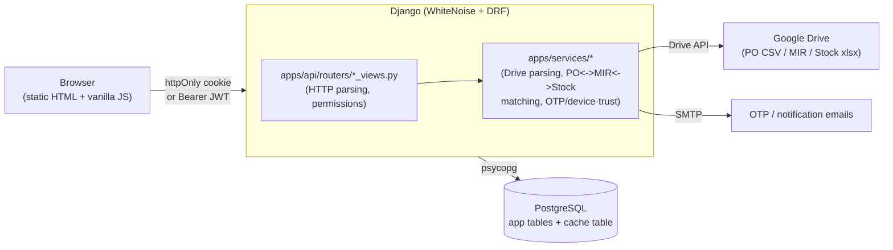
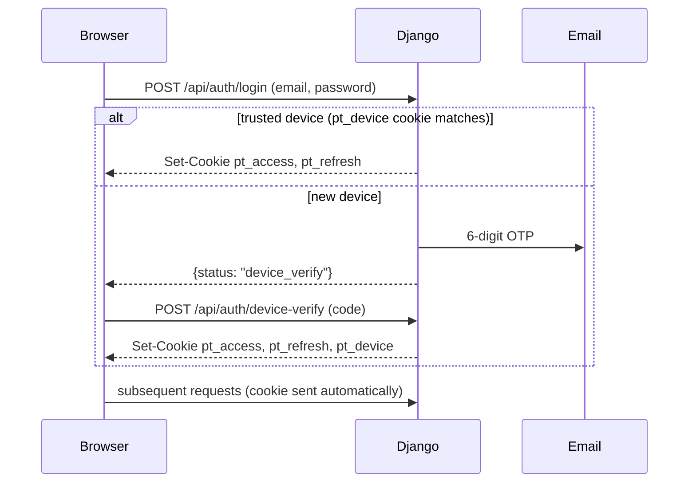

# Architecture

A lightweight map of how the pieces fit together. For conventions, rationale, and the gotchas that
have already bitten this project, see [CLAUDE.md](CLAUDE.md); for setup, see [README.md](README.md).

This app's auth/security scaffolding is a deliberate port of the TDS Automation App's architecture
(`C:\Users\Admin\OneDrive\Desktop\TDS Automation App\tds_app`) - same conventions, different domain.
See CLAUDE.md's "Auth & security" for what was ported, what was deliberately left out, and why.

## Request flow

## Layering rules

- **`apps/core`** - models and migrations only. No views, no business logic: parsers, matching
  engines, Drive access and sync helpers all live in `apps/services`.
- **`apps/api/routers/*_views.py`** - the HTTP layer. Parse the request, check permissions, call a
  service function or query the ORM directly for simple reads, shape the response. Do not embed
  Drive-parsing or matching logic here.
- **`apps/services/*`** - Drive access (`google_client.py`), per-plant parsers (`parsers/`), the
  matching engines (`matching.py` / `matching_achhad.py` / `matching_vapi.py` over the shared
  `matching_core.py`), change-detection (`sync_utils.py`), the auth-adjacent services
  (`device_service.py`, `otp_service.py`, `email_service.py`, `password_service.py`), and the
  security-adjacent ones (`token_revocation.py` for refresh-token revocation and per-account "log
  out everywhere", `security_alerts.py` for admin alerts on lockout, login bursts, and sync
  failures). `apps/core/checks.py` (registered via `CoreConfig.ready()`) runs deploy-time Django
  system checks - not services logic, but conceptually adjacent.
- Several modules are **deliberately dependency-free** (no Django imports at all), so they unit-test
  as plain Python and are safe to import from a migration's `RunPython`: `parsers/common.py`,
  `validation.py`, `stock_identity.py`, `arithmetic_checks.py`, `stock_consumption.py`. Each has its
  DB-touching counterpart in a separate module where one is needed (e.g. `data_quality.py` over
  `arithmetic_checks.py`).

### Router map

| Router | Scope |
| --- | --- |
| `hrs_views.py` / `achhad_views.py` / `vapi_views.py` | one domestic plant each |
| `_domestic_base.py` | the shared HTTP-layer code all three are built from |
| `imports_views.py` | import POs, RoDTEP and Advance Licence - cross-plant, plant as a path segment |
| `review_views.py` | the match-accuracy review queue - cross-plant |
| `users_views.py` / `admin_overview_views.py` | admin panel |
| `auth_views.py` / `device_views.py` / `google_oauth_views.py` / `password_views.py` | auth |
| `reports_views.py` | shared-secret endpoints the external scheduler triggers |

**`_domestic_base.py`** holds the view-layer code previously copy-pasted across the three domestic
routers: a `_PlantConfig` dataclass plus `make_*` factory functions each router calls once at import
time. This does not contradict "per-plant models" below - only the plumbing is shared; genuine
per-plant schema differences are carried as `_PlantConfig` values, never as branching inside the
shared module. See CLAUDE.md's "Domestic router de-duplication".

### Frontend

Static, no build step. `frontend/js/auth.js` has no imports and must load first on every protected
page - it gates the page behind `requireAuth()` before that page's own script runs. Everything else
is one plain `<script>` tag per concern sharing a single global scope, so load order matters;
`main.js`'s header comment holds the current module map.

CSS is layered: `brand.css` (shared top nav) → `style.css` (dashboard) → `css/<page>-page.css`.
`index.html` is the only page loading the first two together. There is no bundler and no ES modules;
the per-file split exists so CSP's `script-src` could drop `'unsafe-inline'` entirely.

## Data model shape

**Per-plant models, not a shared schema** (see CLAUDE.md for the full rationale - each plant's
MIR/Stock spreadsheets genuinely differ in layout). `HRSDomesticPurchaseOrder` /
`RTPAchhadDomesticPurchaseOrder` / `RTPVapiDomesticPurchaseOrder` and their `*POLineItem` /
`*MIREntry` / `*RMLot` / `*RMSnapshot` / `*POMirMatch` / `*MirStockMatch` siblings are fully
independent per plant, as are the `*ImportPurchaseOrder` / `*ImportPOLineItem` / `*ImportPOMirMatch`
sets.

Shared, plant-agnostic tables:

- `SyncRun` - a generic sync-job log with a `plant` field, not a plant-shaped data table.
- Auth: `PTUser` (`pt_users`), `OTPCode` (`pt_otp_codes`), `TrustedDevice` (`pt_trusted_devices`),
  `RevokedRefreshToken`, `PTAuditLog` (`pt_audit_log`).
- Corrections and overrides: `DomesticPOCorrection`, `ImportPOCorrection`, `MaterialCorrection`,
  `FlagDismissal`, `MatchReview`, `DataQualityFlag`.
- Company-wide ledgers and reference data: `RodtepScrollEntry`, `RodtepUsage`, `AdvanceLicense`,
  `AdvanceLicenseMaterial`, `MaterialCategoryReference`, `ReportSendLog`.

## Auth flow

`pt_access` (12h) and `pt_refresh` (30 days, path-scoped to `/api/auth/`) are httpOnly, and the
refresh token never appears in a response body. A non-browser client can skip cookies and send
`Authorization: Bearer <access_token>` instead - `PTCookieJWTAuthentication` tries the cookie first,
then the header. Google OAuth (`GET /api/auth/google/login/`) goes through the identical
device-trust gate after Google authenticates the user.

**`PTUser` is not a Django auth user**, and `AUTH_USER_MODEL` is deliberately left at `auth.User`.
Every authentication path resolves `PTUser` explicitly. Any code calling `get_user_model()` will
silently resolve to the wrong model - CLAUDE.md documents the production incident this caused in the
TDS app, and why `rest_framework_simplejwt.token_blacklist` must never be added to `INSTALLED_APPS`
here.

## Background jobs

- **Sync + match** - one `django_q.models.Schedule` row (`manage.py ensure_schedules`, idempotent)
  running `sync_trigger.run_daily_sync_all_plants()` hourly from 9:00 AM to 8:00 PM IST. It covers
  all three plants' domestic and import pipelines plus the company-wide RoDTEP and Advance Licence
  syncs. Admin- and dashboard-triggered `sync-trigger` endpoints run the same pipelines on demand.
- **Report emails** - the daily and monthly RM consumption reports, the Advance Licence expiry
  alerts and the plant data correction report are each triggered by an external scheduler
  (cron-job.org) hitting its own shared-secret-protected endpoint under `/api/internal/`, since
  Render has no built-in cron on this plan. Three are scheduled as of 2026-09-22 (consumption 20:30
  IST daily, monthly 10:00 IST on the 1st, licence expiry 10:00 IST daily) - see CLAUDE.md's
  scheduling section for the cron expressions and why the licence job runs daily rather than on each
  licence's 30-days-out date. The mismatch report is unscheduled while its feature flag is off, and
  `prune_revoked_tokens` has such an endpoint too, with no cadence currently configured.
- **Email dispatch** - sent from the web process through two bounded thread pools (one lane reserved
  for OTPs), deliberately not through django-q2. CLAUDE.md explains why queueing them would make
  login depend on the worker being alive.

## Local dev with Docker

`docker compose up -d` runs the app, a `qcluster` worker, and a real Postgres. Local dev only - it
does not replace `render.yaml`'s deploy pipeline. The `Dockerfile` pins `python:3.12-slim` to match
Render's actual runtime rather than this repo's own `.python-version` (`3.14`), and
`docker-compose.yml` sets `DATABASE_URL` itself pointed at its own `db` service, so no `.env` edits
are needed. See CLAUDE.md's "Deployment, Docker, and `.env`".

## Known architectural constraints

- **Read endpoints are role-open but plant-scoped.** Every read (PO list, materials, stock trend,
  sync status, domestic and import) is plain `IsAuthenticated` on *role* - any role can read, by
  design - but narrows by `PTUser.plants` via `permissions.user_can_access_plant()`. An empty
  `plants` list means "all plants". Writes are gated at `IsEditor`/`IsAdmin` plus the same plant
  check. CLAUDE.md has the endpoint-by-endpoint list.
- **`cache_page` infrastructure exists and nothing uses it.** `DatabaseCache` is wired up and
  test-safe, but every current endpoint is real business data behind auth, not the public reference
  data `cache_page` is safe to sit in front of - and it must never sit above a permission check.
- **No pagination.** Every list endpoint returns its full result set and the frontend filters
  client-side. Changing this would mean moving every filter in `po-list.js` / `materials.js` /
  `import-po.js` server-side, which is why it hasn't been done.
- **The Drive layer has no automated test coverage.** The API, matching, parsing and auth layers do;
  the actual Drive API calls and the `sync_*` commands' file-fetching are verified manually.
- **Matching is a suggestion layer, not a source of truth.** Accuracy has never been measured against
  labelled ground truth. Nothing downstream should act on a match without a human in the loop.
